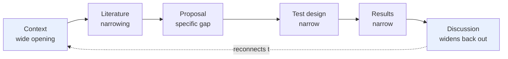

# Academic Writing Rules: A Unified Synthesis

A consolidated reference drawing on Julian Allwood's Cambridge Engineering writing class, the canonical style manuals (Williams & Bizup, Strunk & White, Zinsser, Pinker, Sword, Schimel, Moran, Graff & Birkenstein), Amazon's six-pager discipline, and supervisor feedback patterns from Serrenho. The aim is a single working document that a researcher can hold open while drafting and editing an engineering paper, thesis chapter, or review.

The rules are organised from the architecture of the whole paper down to the choice of individual words. Each rule is stated, then justified, then shown in action where that helps.

---

## Part I: The Architecture of the Paper

### Rule 1: Every paper contains six identifiable elements

Allwood's account of the paper, consistent with Schimel's OCAR and the CARS model, treats every research paper as an argument with six moves:

1. **Context.** The world would be a better place if only...
2. **Literature.** Everyone who looked at this problem before has given us some insight, but there is a gap.
3. **Proposal.** We have an idea for what might fill the gap. For the first time...
4. **Design of test.** If someone did not believe us, how would they test whether our proposal helps to fill the gap?
5. **Results.** Without any personal interpretation, the results show that...
6. **Discussion.** Our interpretation of the results is... We have filled the gap to some extent, but not completely.

Nature-style compressed structure folds the first three into a single introduction and pushes methods to the end, but the six elements remain.

Schimel's hourglass principle governs the shape: the width of the opening context must match the width of the resolution. If the introduction promises to change the world and the discussion reports a 3 percent efficiency gain, the paper overpromises.

### Rule 2: A paper must make a new, significant, transferable contribution

Every word matters:

- **New:** not previously known.
- **Significant:** something substantive has been learned.
- **Transferable:** useful outside the precise conditions of the experiment.

The reviewer's job is to judge whether all three hold. The writer's job is to make the judgement easy.

### Rule 3: Write for the skim-reader

A reviewer reading 50 papers a week reads fully only four things:

- Title and abstract
- End of the literature review (for the gap statement)
- End of the conclusion
- Figure captions

These four locations must be the strongest, clearest, most compelling parts of the paper. Everything else is read at speed.

### Rule 4: Start from the killer graph and work backwards

The recommended process, drawing on Allwood and Schimel:

1. Identify the one or two figures that capture your novel contribution.
2. Prepare and deliver a presentation to a real audience to test the narrative.
3. Sketch the outline: headings, sub-headings, one bullet per paragraph.
4. Agree the paragraph-by-paragraph plan with co-authors before drafting.
5. Hide for two uninterrupted days and write the paper in one pass.
6. Edit for detail.
7. Walk away for two weeks.
8. Edit again for the reader: is there anything at all that could make the reader's life easier?

Forget how you spent your time doing the work. Work out what the key new contribution is, and design the narrative backwards from the conclusion.

---

## Part II: Writing for the Reader

### Rule 5: Signpost every structural level

Papers should follow a pyramid structure: Situation → Problem → Question → Answers. Each level is signposted.

- Each section opens with motivation and structure, and closes with a resolution.
- Each sub-section and paragraph has one clear theme.
- Use section headings as signposts. Before diving into details, tell the reader what to expect.
- Never assume the reader will infer the structure. Make it explicit.

### Rule 6: Minimise metadiscourse, even while signposting

Pinker's caution balances the signposting rule. Sentences like *"In this section, we will discuss..."*, *"As we shall see..."*, and *"The remainder of this paper is organised as follows..."* are verbiage about verbiage. Keep them to a minimum. Headings do most of the signposting work.

### Rule 7: Lead with the point, not the promise

Moran's principle of front-loading meaning. Weak openers to avoid:

- *It is important to note that...* → state the fact
- *It is worth noting that...* → state the fact
- *The purpose of this paper is to...* → lead with what you did
- *In this paper, we...* → lead with the action or finding
- *As mentioned earlier...* → just state the point

### Rule 8: Match sentence rhythm to argument

Moran's rhythm principle: earn long sentences with short ones. Three consecutive long sentences flatten the prose. Vary length deliberately.

---

## Part III: The Argument in Conversation

### Rule 9: Cite to engage, not to pad

This is the rule around references the supervisor specifically flagged. Graff & Birkenstein's *They Say / I Say* diagnosis: academic writing is fundamentally a dialogue with existing scholarship. A citation dumped at the end of a sentence is a dead citation.

**What to avoid:**

- *Data centre energy use is rising (Smith 2022).*
- *Several studies have examined this (Jones 2019; Lee 2020; Park 2021).*

Both patterns use the citation as a footnote rather than as an interlocutor. The reader learns that someone, somewhere, said something adjacent to the claim. They do not learn what that someone actually argued, what evidence was offered, or why the present author mentions it.

**What to do instead.** Every citation should answer three questions:

1. **Who says it?** Name the author in the sentence, not only in the parenthesis.
2. **What do they claim?** State the specific finding or argument, not a generic gesture at the topic.
3. **Why is it relevant here?** Link the cited work to the present argument. The citation should do work for your paper, not merely certify that you read something.

The Graff & Birkenstein template:

> *X argues [specific claim]. This matters for the present work because [link to your argument].*

**Worked examples:**

*Weak:* *"Data centre electricity demand is growing rapidly (IEA 2024)."*

*Stronger:* *"The IEA (2024) projects data centre electricity demand will double by 2026, driven primarily by AI workloads rather than cloud storage. This distinction matters here because cooling architectures optimised for steady-state cloud traffic perform poorly under the burst loads characteristic of training runs."*

The strong version names the source as a subject, states the specific claim with its driver, and tells the reader why the citation is in the sentence at all.

**Reporting verbs matter.** Vary and choose them deliberately: *argues, demonstrates, found, reported, suggested, observed, contends, shows, measured, estimated*. Each carries a different epistemic weight. *Suggests* hedges where *demonstrates* commits.

**Evaluate, do not list.** When reviewing multiple sources, synthesise the positions. Do not walk through them sequentially. The pattern *"Smith (2019) found X. Jones (2020) found Y. Lee (2021) found Z."* is a catalogue, not a literature review. The pattern *"Three lines of evidence suggest X: Smith's spectroscopy measurements, Jones's thermodynamic modelling, and Lee's field observations. They disagree on magnitude but converge on direction."* is an argument.

### Rule 10: Position your contribution relative to existing debate

The *They Say / I Say* templates scaffold academic positioning:

- *While X argues..., I contend...*
- *Building on X's framework...*
- *In contrast to X...*
- *Although it is true that X..., it does not follow that Y...*
- *Extending X's approach to a new domain...*

These are not formulas. They are the deep moves of academic discourse. A paper that never positions itself against existing work reads as if it exists in a vacuum. A reviewer will ask: *what is new?*

### Rule 11: Cite with purpose or not at all

Never cite without purpose. Each citation should:

- Support a specific claim, or
- Establish a specific gap, or
- Credit a specific prior contribution you are building on.

Citations inserted to signal coverage of the literature pad the paper without strengthening it.

---

## Part IV: Characters and Actions

### Rule 12: The subject should name a character; the verb should name the action

Williams's central principle, echoed by Pinker, Sword, and Schimel. Readers locate who or what a sentence is about in its subject, and what is happening in its verb. When writers bury the action in a noun and let the verb go slack, readers have to reconstruct the story from fragments.

**Diagnostic:**

| Weak | Strong |
|---|---|
| An analysis of the data was conducted | We analysed the data |
| The implementation of the policy was performed | The committee implemented the policy |
| A reduction in energy consumption was observed | Energy consumption decreased |
| There was a failure of the cooling system | The cooling system failed |
| The researchers performed an analysis | The researchers analysed |

### Rule 13: Kill zombie nouns

Sword's term for nominalisations, verbs and adjectives turned into abstract nouns, usually ending in *-tion, -ment, -ness, -ance, -ity, -ing*. They drain the life from prose.

**Detection heuristic:** If a nominalisation is preceded by *a / an / the* and followed by *of*, it can almost always be converted back to a verb.

**Acceptable nominalisations:**

- When the concept is itself the subject of study (*the analysis revealed three patterns*).
- When replacing an awkward *the fact that* (*their refusal surprised us*).
- When it is a standard disciplinary term (*combustion, transmission, absorption*).

### Rule 14: Keep subjects and verbs close together

Williams and Sword: when the subject and verb are separated by more than about ten words, readers lose track of the sentence's framework. Long parenthetical clauses between subject and verb are the usual culprit.

**Weak:** *The analysis of the data collected from three separate field sites over the course of two years reveals...*

**Stronger:** *The analysis reveals three patterns across the two-year dataset from three field sites.*

### Rule 15: Empty verb plus nominalisation equals wasted words

Williams's pattern. When you see *make, do, perform, conduct, carry out, have, give, take, provide* paired with an abstract noun, the real verb is inside the noun. Free it.

- *made a decision* → *decided*
- *provided an explanation* → *explained*
- *reached a conclusion* → *concluded*
- *had an influence on* → *influenced*
- *took action* → *acted*
- *gave a presentation* → *presented*
- *carried out an investigation* → *investigated*

### Rule 16: Prefer active voice; use passive deliberately

Active voice is the default. Passive is the exception, used when:

- The agent is unknown or irrelevant.
- The agent is less important than the action or object.
- Topic continuity requires it (keeping the same subject across sentences).
- The discipline conventionally uses passive in Methods.

Avoid the dangling passive: *Based on the results, it was concluded...* → *Based on the results, we concluded...* Avoid the agentless passive when the reader needs to know who acted: *It was decided that the project would be cancelled* — by whom?

---

## Part V: Concision and Clutter

### Rule 17: If removing a word does not change the meaning, remove it

Zinsser, Strunk & White, and Allwood all converge here. Vigorous writing is concise. A sentence contains no unnecessary words, a paragraph no unnecessary sentences, for the same reason a drawing has no unnecessary lines.

**Filler phrases with one-word equivalents:**

| Cluttered | Concise |
|---|---|
| due to the fact that | because |
| in order to | to |
| at this point in time | now / currently |
| in the event that | if |
| it is important to note that | notably, or remove |
| a large number of | many (or a specific number) |
| the vast majority of | most (or a percentage) |
| has the ability to | can |
| in spite of the fact that | although / despite |
| on the basis of | based on |
| with regard to | regarding |
| in the context of | in / during |
| prior to | before |
| subsequent to | after |
| in close proximity to | near |
| is indicative of | indicates / suggests |
| take into consideration | consider |
| in light of the fact that | because / since |
| given the fact that | since |

### Rule 18: Cut inflated vocabulary

Zinsser's list. Latinate or complex words where simpler ones exist:

- *utilise* → use
- *facilitate* → help / ease
- *endeavour* → try
- *sufficient* → enough
- *numerous* → many (or a number)
- *commence* → begin
- *terminate* → end
- *approximately* → about
- *methodology* → method (methodology is the study of methods)
- *functionality* → function
- *conceptualise* → conceive
- *operationalise* → apply
- *problematise* → question

### Rule 19: Drop redundant modifiers and empty intensifiers

Redundant pairs where the modifier is already implied:

- *completely eliminate* (eliminate already means completely)
- *future plans* (plans are about the future)
- *past history* (history is past)
- *end result* (results are endings)
- *basic fundamentals* (fundamentals are basic)
- *close proximity* (proximity means close)
- *exact same* (same is exact)
- *new innovation* (innovations are new)
- *still remains* (remains implies continuity)
- *absolutely essential* (essential is absolute)
- *completely finished* (finished is complete)

Empty intensifiers that add no precision: *very, really, extremely, quite, fairly, rather, somewhat, highly*. Either quantify the claim or remove them. *Very large* is a judgement. *140 MW* is a fact.

### Rule 20: Re-order before adding words

The phrases *in terms of* and *with respect to* almost always mean the sentence started in the wrong place. The same goes for *making it*. Re-order and the phrase is not needed.

**Weak:** *"...making it unclear how resource-intensive these scenarios are."*
**Stronger:** *"As a result, the resource-intensity of these scenarios is unclear."*

**Weak:** *"The cost of the purchase of the energy..."* (three *of*s)
**Stronger:** *"The energy purchase cost."*

Repeated *of* and *as* indicate word-order problems. Re-order before adding words.

### Rule 21: Eliminate expletive constructions

*There is / there are / it is* constructions delay the real subject.

- *There are three factors that influence...* → *Three factors influence...*
- *It is clear that the system failed* → *The system failed* (or show how it failed)
- *There is a need to investigate...* → *Researchers need to investigate...* (and name who)

---

## Part VI: Precision and Quantification

### Rule 22: Quantify where you claim magnitude

Serrenho's and Amazon's convergent rule. Weasel words that assert size without measuring it:

- *significantly, substantially, considerably, dramatically, massively, hugely, enormously, vastly*
- *rapidly, exponentially* (is it actually exponential, or just fast?)
- *numerous, several, many, various, some, few*
- *widely, generally, largely, mostly*

Replace with a number, a range, a rate, or a percentage. If *significantly* is real, say how significant. If it is not, delete it.

**Weak:** *"Energy consumption increased significantly."*
**Stronger:** *"Energy consumption increased by 34 percent, from 4.2 to 5.6 GWh."*

### Rule 23: Avoid rhetorical tells of unwarranted certainty

Amazon's weasel-word principle against assumed agreement:

- *clearly, obviously, of course, needless to say, it should be noted that, interestingly, importantly*

These phrases ask the reader to accept a conclusion rather than demonstrating it. If it is clear, the evidence speaks for itself. If it is important, the reader will judge.

### Rule 24: Match hedging strength to evidence

Short certain statements are good. Long hedged ones undermine confidence. Calibrate:

- Direct experimental evidence → *demonstrates, shows, establishes*
- Strong correlational evidence → *indicates, suggests*
- Theoretical or indirect evidence → *implies, appears to, tends to*
- Speculation → *may, might, could*

Do not stack hedges: *"It might possibly be the case that the results could perhaps suggest..."* → *"The results suggest..."*. Do not under-hedge either: *"X proves Y"* is almost always overconfident. Empirical results rarely prove; they provide evidence.

### Rule 25: Name entities accurately

Serrenho's supervisor rule. Do not mislabel organisations. The IEA is intergovernmental, not commercial. The WHO is intergovernmental, not commercial. The UN is intergovernmental. Small accuracy failures cost credibility.

### Rule 26: Define technical terms and acronyms at first use

Computers unpack acronyms easily. Humans use familiar words to build understanding. Rules:

- Never use acronyms unless already in common non-specialist use.
- Spell out the full term at first occurrence, followed by the abbreviation in parentheses.
- After definition, use the abbreviation exclusively.
- Do not create abbreviations for terms used fewer than three times.
- Re-define abbreviations in the abstract (the abstract must be self-contained).

Specific terms that supervisors consistently flag if undefined: *CAGR (Compound Annual Growth Rate), PUE (Power Usage Effectiveness)*, and any field-specific acronym on first appearance.

### Rule 27: Present statistics so the message is clear

Do not force the reader to do arithmetic. Instead of *"15 percent of US hydro capacity is in California, and California's total electricity generation is 9 percent hydro,"* calculate the relevant ratio or change directly. Every figure and table must be referenced in the text before it appears, with a descriptive caption.

---

## Part VII: Sentence Craft

### Rule 28: Prefer the simplest verb form

- Present tense over compound tenses where meaning permits.
- Do not overcomplicate: *has extensively been used* → *is widely used* → *is used*.
- Do not split infinitives: *to boldly go* → *to go boldly* (or rephrase).
- Do not split compound verbs: *The operation had, when evaluated objectively, finished* → *When evaluated objectively, the operation had finished.*

### Rule 29: Tense consistently and purposefully

- **Past tense** for completed research actions, yours and others': *We collected data... Smith (2020) reported...*
- **Present tense** for established facts, general truths, current arguments, and figure references: *Data centres consume 1 to 2 percent of global electricity. Figure 3 shows...*
- **Present perfect** for bodies of literature with ongoing relevance: *Several studies have examined...*
- **Future tense** only for recommendations: *Future research should...*

Do not flip between tenses within a paragraph unless the shift is semantically motivated.

### Rule 30: End sentences on the emphatic information

Williams's and Schimel's stress-position principle. The end of a sentence is the power position. Put the most important new information there.

**Weak:** *"The results were surprising, given the model's predictions, in several respects."*
**Stronger:** *"Given the model's predictions, the results were surprising in several respects."* (The surprise lands at the end.)

### Rule 31: Prefer positive to negative form

Strunk & White: state what is, not what is not.

- *not honest* → *dishonest*
- *not important* → *trivial / unimportant*
- *did not remember* → *forgot*
- *not the same* → *different*
- *not unlike* → *similar*

### Rule 32: Keep parallel structures parallel

In lists and comparisons, items must share grammatical form.

**Weak:** *The system reduces cost, improves efficiency, and emissions are lower.*
**Stronger:** *The system reduces cost, improves efficiency, and lowers emissions.*

---

## Part VIII: Paragraph Architecture

### Rule 33: One paragraph, one point

Each paragraph develops a single idea. Structure:

- **Topic sentence** stating the paragraph's main claim.
- **Supporting sentences** providing evidence, examples, data, or reasoning.
- **Closing or linking sentence** synthesising the point or connecting to the next paragraph.

Aim for four to eight sentences. Paragraphs that exceed 200 to 250 words usually contain more than one idea.

### Rule 34: Open paragraphs with their topic, not with continuation

Schimel's rule. Continuation connectives (*Moreover, Furthermore, Additionally, Similarly, Likewise, Equally, Then*) link backwards rather than establishing what the new paragraph is about. They are acceptable mid-paragraph. At the start, they signal that the writer did not plan the argument.

Allwood's parallel rule: do not open paragraphs with *Another* or *In addition*. Both mean *I just thought of something else*.

### Rule 35: Cohesion through old-to-new information flow

Williams's principle. Each sentence begins with information the reader already has (the topic position) and ends with new information (the stress position). The next sentence picks up that new information and carries it forward.

**Heuristic:** Check whether key terms from the end of sentence N appear near the beginning of sentence N+1. If not, the reader is asked to leap.

### Rule 36: Each paragraph has its own micro-story

Schimel's story arc repeats at paragraph level. Opening (what is this about), action (what happens), resolution (what we take away). Paragraphs that list facts without a *so what* are data dumps.

---

## Part IX: Formality and Voice

### Rule 37: No contractions

*Don't, can't, it's, we've, they're* have no place in formal academic writing. Expand them all.

### Rule 38: No colloquialisms, phrasal verbs where alternatives exist, or emotive marketing language

- *a lot of* → many / numerous / a specific number
- *get rid of* → eliminate / remove
- *find out* → determine / ascertain
- *kind of, sort of* → somewhat (or remove)
- *carry out* → conduct / perform
- *bring about* → cause
- *come up with* → propose / develop
- *look into* → investigate
- *set up* → establish
- *point out* → indicate / note
- *groundbreaking, revolutionary, game-changer, cutting-edge* → novel, significant, transformative, state-of-the-art
- *at the end of the day, it goes without saying, the bottom line, basically, literally (as intensifier), pretty much* → remove or rewrite

### Rule 39: No rhetorical questions

Questions belong in presentations, not papers. Restate as a claim or a proposition.

### Rule 40: Banned words

Allwood's list of words that have no place in engineering academic writing:

| Banned | Why | Replacement |
|---|---|---|
| *issues, challenges* | Vague. Teenagers have issues. | *problems, constraints, limitations, barriers* |
| *perspective* | Only named people have perspectives | Restructure |
| *successful* | Marketing language | *effective, demonstrated, validated* |
| *seems* | Present the evidence | *indicates, suggests* |
| *highlight* (as verb) | Not academic | *reveals, examines, emphasises* |
| *relatable* | Not academic | *accessible, clear, intuitive* |
| *in terms of, with respect to* | Wrong word order | Re-order the sentence |
| *making it* | Wrong word order | Rewrite |
| *there is a need to* | Hides the agent | Name who needs to act |

---

## Part X: The Review Paper

### Rule 41: A review converts a catalogue into knowledge

Allwood's distinction between two activities:

1. **Finding everything.** Search forwards, backwards, sideways. Challenge your assumed keywords. Even an expert reviewer discovers only about half of relevant papers on first pass.
2. **Converting the catalogue into knowledge.** Not a summary of summaries. Apply the data to information to knowledge hierarchy:
   - **Data:** the underlying numbers and results.
   - **Information:** the heuristics and categories that organise the data.
   - **Knowledge:** what we take away and how we can use it.

### Rule 42: Make multiple cuts across the same material

- **History:** how knowledge built up and why.
- **Techniques:** what approaches have been used.
- **Results:** what insights emerged.
- **Synthesis:** where are we relative to where we want to be.
- **Gaps:** what do we not know.

### Rule 43: For each paper, report three things

When bullet-pointing each source in the review:

1. What the authors claim.
2. What evidence they provide.
3. How you evaluate the claim.

Evaluation is the point. A review without evaluation is an annotated bibliography.

---

## Quick-Reference Checklist

| Check | Question |
|---|---|
| Six elements | Can a reviewer identify all six in under 60 seconds? |
| Killer graph | Is the central contribution visible in one or two figures? |
| Skim targets | Are title, abstract, end of lit review, conclusion, and captions the strongest parts? |
| Signposting | Does every section open with its purpose and close with its result? |
| Front-loading | Does every paragraph open with its point? |
| Citations | Does every reference name the author, state the claim, and explain the relevance? |
| Positioning | Is the contribution positioned against specific existing work? |
| Characters and actions | Are subjects real characters and verbs real actions? |
| Zombie nouns | Have you converted *the X of Y* constructions back to verbs? |
| Subject-verb distance | Are subjects and verbs within about ten words of each other? |
| Concision | Can any word be removed without changing the meaning? |
| Inflated vocabulary | Could any word be replaced with a simpler one? |
| Re-order | Do *in terms of, with respect to, making it* signal wrong word order? |
| Quantification | Have all weasel words been replaced with numbers or removed? |
| Hedging | Does the strength of each claim match the strength of the evidence? |
| Acronyms | Is every acronym defined on first use and necessary? |
| Positive form | Can negatives be restated positively? |
| Parallel structure | Do list items share grammatical form? |
| Paragraphs | Does each paragraph make one supported point with a clear topic sentence? |
| Cohesion | Does each sentence pick up the end of the previous one? |
| Formality | No contractions, colloquialisms, rhetorical questions, or banned words? |
| Tense | Consistent within paragraphs, intentional across sections? |

---

## Sources

- Allwood, J. Cambridge Engineering academic writing class materials.
- Amazon. Six-pager writing discipline, internal weasel-word guidance.
- Graff, G. & Birkenstein, C. (2010). *They Say / I Say: The Moves That Matter in Academic Writing* (2nd ed.). W.W. Norton.
- Moran, J. (2018). *First You Write a Sentence*. Viking.
- Pinker, S. (2014). *The Sense of Style*. Penguin.
- Schimel, J. (2012). *Writing Science*. Oxford University Press.
- Serrenho, A. Supervisor feedback patterns on engineering drafts.
- Strunk, W. Jr. & White, E.B. (2000). *The Elements of Style* (4th ed.). Longman.
- Sword, H. (2012). *Stylish Academic Writing*. Harvard University Press.
- Williams, J.M. & Bizup, J. (2016). *Style: Lessons in Clarity and Grace* (12th ed.). Pearson.
- Zinsser, W. (2006). *On Writing Well* (30th anniversary ed.). Harper Perennial.
